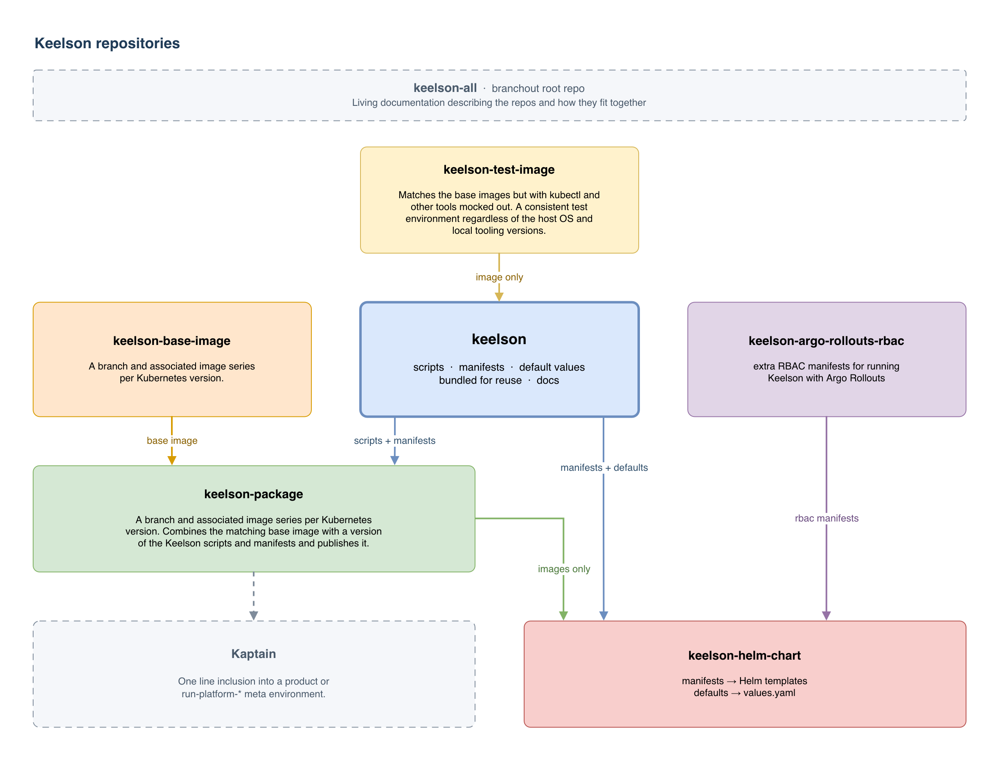

# Keelson

The part of a boat directly above and on top of the [keel](https://keel.sh).


# Branchout repo management

The small set of related repos in the `keelson-pro` GitHub org are managed here
using [Branchout/branchout](https://github.com/Branchout/branchout), a tool for
documenting and working with a set of repos in a consistent way. This project is
for those looking to tinker with the small Keelson ecosystem. To use it, start
by [installing branchout with brew](https://github.com/Branchout/branchout#brew)
or by cloning it and adding it to your path, then running one of the following
commands on your machine:

```bash
branchout init git@github.com:keelson-pro/keelson-all.git
# or
branchout init https://github.com/keelson-pro/keelson-all.git
```

Then the following two commands, in order:

```bash
cd ~/projects/keelson-all
branchout pull
```

After which you can explore the repositories inside `~/projects/keelson-all/keelson/`.

The relationships between them are illustrated in the Keelson Ecosystem diagram
below. Click the image to see a better view in a full window or tab.

[](https://raw.githubusercontent.com/keelson-pro/keelson-all/main/images/keelson-ecosystem.png)

The repos, in the order the diagram flows:

1. [keelson-all](https://github.com/keelson-pro/keelson-all) (this repo)
2. [keelson-test-image](https://github.com/keelson-pro/keelson-test-image) (OCI image for tests)
3. [keelson](https://github.com/keelson-pro/keelson) (main repo and docs)
4. [keelson-base-image](https://github.com/keelson-pro/keelson-base-image) (OCI base images for keelson-package)
5. [keelson-argo-rollouts-rbac](https://github.com/keelson-pro/keelson-argo-rollouts-rbac) (for Argo Rollouts users)
6. [keelson-package](https://github.com/keelson-pro/keelson-package) (runtime images, and for Kaptain)
7. [keelson-helm-chart](https://github.com/keelson-pro/keelson-helm-chart) (for Helm users)


# Why clone Keel?

Keelson is very much inspired by and a clone of and rewrite of Keel. It is more
opinionated in that it only supports immutable tag operation and will not even
attempt to update the underlying image for a tag that has not changed. Keel has
average documentation and poor logging. Keel has a large but inactive community
where getting any help takes months or simply never happens.

I used Keel for 6 years (from late 2019 on) with great success, until I had to
use it on AKS. On AKS with ACR integration the workload resources don't have an
`imagePullSecrets` section as they don't need it. The same is possible with ECR
and a node role or policy in the node role that allows ECR pulling either
broadly or more specifically. In these scenarios it's necessary to configure an
access credential specifically for Keel to use. I tried a dozen or more ways
and eventually gave up, adding imagePullSecrets to every workload spec that
needed an auto deploy using Keel. This was a bad experience end to end and
extremely frustrating to say the least. I vowed to do better. Keelson is the
result.


# License

Keelson is MIT licensed except for `*.md` Markdown docs which are CC-BY-SA-4.0.
For more detail see [LICENSE.md](https://github.com/keelson-pro/.github/blob/main/LICENSE.md).


# More info

See [CLAUDE.md](CLAUDE.md) for more information until this README.md is enriched.
